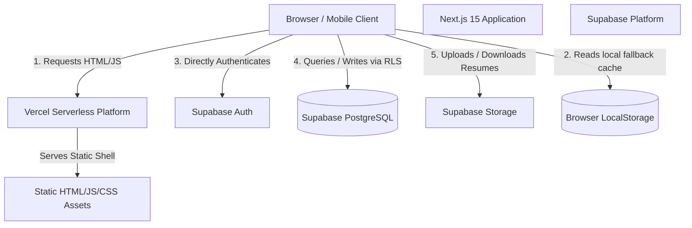
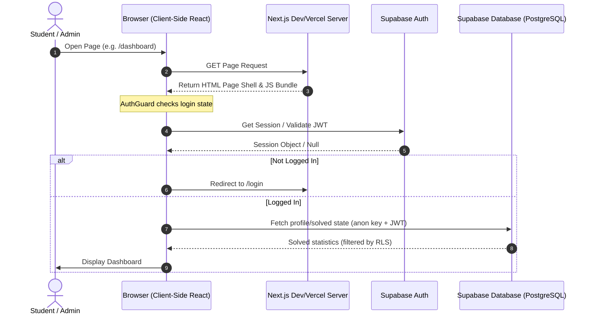

# CareerBridge AI - Architecture Audit & Performance Analysis

This document provides a comprehensive overview of the current system architecture, request flows, security posture, and scalability recommendations for the CareerBridge AI application.

---

## 1. System Architecture Diagram



---

## 2. Request-Flow Diagram



---

## 3. Route Classification

| Route Path | Type | Auth Required | Access Level | Data Source | Caching Strategy |
| :--- | :--- | :--- | :--- | :--- | :--- |
| `/` | Static Shell | No | Public / Guest | Static data (`journeySteps`, `faqData`) | Cacheable (Edge) |
| `/login` | Static Shell | No | Public / Guest | Client-side only | Cacheable (Edge) |
| `/register` | Static Shell | No | Public / Guest | Client-side only | Cacheable (Edge) |
| `/admin/login` | Static Shell | No | Public / Guest | Client-side only | Cacheable (Edge) |
| `/dashboard` | Dynamic Shell | Yes | Student | Supabase `profiles` & local storage | No-store (Private) |
| `/profile` | Dynamic Shell | Yes | Student | Supabase `profiles` | No-store (Private) |
| `/resume` | Dynamic Shell | Yes | Student | Supabase `resume_analyses` | No-store (Private) |
| `/settings` | Dynamic Shell | Yes | Student | Supabase `profiles` | No-store (Private) |
| `/leaderboard`| Dynamic Shell | Yes | Student | Static data (`leaderboard.js`) | Revalidate (10m) |
| `/mock-interview`| Dynamic Shell | Yes | Student | Technical & HR static questions | No-store (Private) |
| `/coding` | Dynamic Shell | Yes | Student | `codingQuestions.js` & Supabase `solved_coding` | Revalidate Questions (1h), Solved State (No-store) |
| `/aptitude` | Dynamic Shell | Yes | Student | `aptitude.js` & Supabase `solved_aptitude` | Revalidate Questions (1h), Solved State (No-store) |
| `/companies` | Dynamic Shell | Yes | Student | `companies.js` & Supabase `company_interactions` | Revalidate Companies (1h), Interaction State (No-store) |
| `/admin` | Dynamic Shell | Yes | Admin Only | Local state / mocked stats | No-store (Private) |
| `/admin/*` | Dynamic Shell | Yes | Admin Only | Local state / mocked stats | No-store (Private) |

---

## 4. Security Findings & Recommendations

### A. RLS Policies Audit
- **profiles**: RLS is enabled. Public read is allowed (`using (true)`), which is fine for displaying names/leaderboard, but update is locked to `auth.uid() = id`.
- **solved_aptitude** & **solved_coding**: Securely locked to `auth.uid() = user_id` for select, insert, and delete.
- **coding_submissions**: Locked to `auth.uid() = user_id` for select and insert. Update is not allowed, maintaining historical integrity.
- **company_interactions**: Fully secured with `auth.uid() = user_id` check.
- **resume_analyses**: Fully secured with `auth.uid() = user_id` check.
- **notifications**: 
  - `select` is locked to `user_id is null` (global) or `user_id = auth.uid()` (private).
  - **Vulnerability**: `Allow all users to insert notifications` has `with check (true)`. This allows any anonymous user to spam global notifications.
  - **Vulnerability**: `Allow all users to delete notifications` has `using (true)`. This allows any anonymous user to delete notifications for all other users.
  - **Fix**: Restrict notifications `insert` and `delete` to admin users only.

### B. Client-side Writes
- All writes are executed directly from client hooks (`useCodingProgress.js`, `useAptitudeProgress.js`, etc.) using the Supabase client. This is valid for Supabase-centric architectures since RLS validates the user's JWT. No service role key is exposed in the frontend.

### C. Admin Portal Authentication
- The admin dashboard is entirely simulated client-side:
  - Entering `admin@careerbridge.com` or setting `role: "admin"` saves a mock user object to `localStorage` under `cb_admin_user`.
  - Next.js has no server-side enforcement of admin roles. A user can easily bypass client-side checks by modifying `localStorage` or local React state.
  - **Fix**: Implement server-side check on API routes and secure Supabase queries using an admin claim check.

---

## 5. Performance & Scalability Findings

- **Third-Party Bundle Size**: Monaco Editor, Recharts, and React Confetti are heavy libraries. If loaded statically on the root page or initial layout, they will block First Contentful Paint (FCP) and increase Time to Interactive (TTI).
  - **Fix**: Use dynamic imports (`next/dynamic`) for Monaco Editor, Recharts, and React Confetti to load them lazy-style.
- **Duplicate Queries / No Cache**:
  - The client fetches profile details and solved state on every page mount. Next.js API routes or caching layers are missing.
- **Lack of Rate Limiting**:
  - High-risk endpoints (such as submit routes or login) have no protection against DDoS or scripting attacks.

---

## 6. Recommended Production Architecture

```
                       Client Browser
                              │
                      Edge CDN (Vercel)
                              │
               ┌──────────────┴──────────────┐
               ▼                             ▼
       Static HTML Shells            Next.js Serverless
                                     (Rate Limiter, API /health)
                                             │
                                     Supabase REST API
                                             │
                                      PostgreSQL (DB)
```

- **Load Balancer**: A custom load balancer is **NOT** needed if deploying to Vercel, as Vercel handles routing, auto-scaling, and failover globally at the edge. A self-hosted balancer using Nginx will be provided only as an optional package under `deployment/self-hosted/`.
- **Database Performance**: Add database indexes to query-heavy columns (e.g., `user_id`, `question_id`, `company_slug`, `question_key`).
